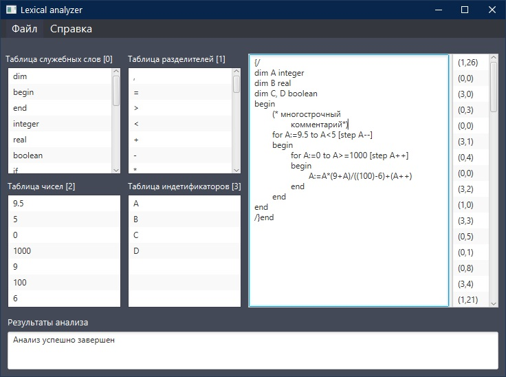

# Analizator
### Описание
Лексический, семантический и синтаксический анализатор. Платформа для создания графического интерфейса JavaFx. Курсовой проект по "Системному программному обеспечению" Шишко А.А. СКС-15 3-й курс.
### Дата
10.06.2018
### Пример работы программы
  
